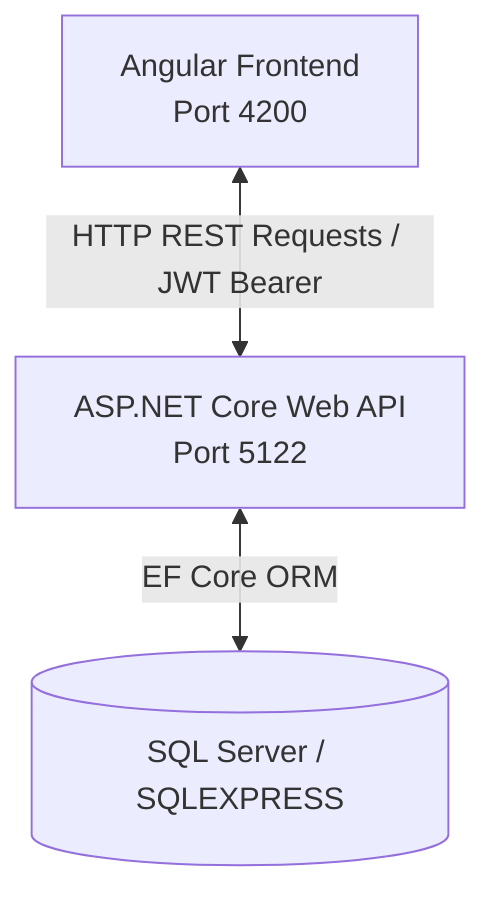
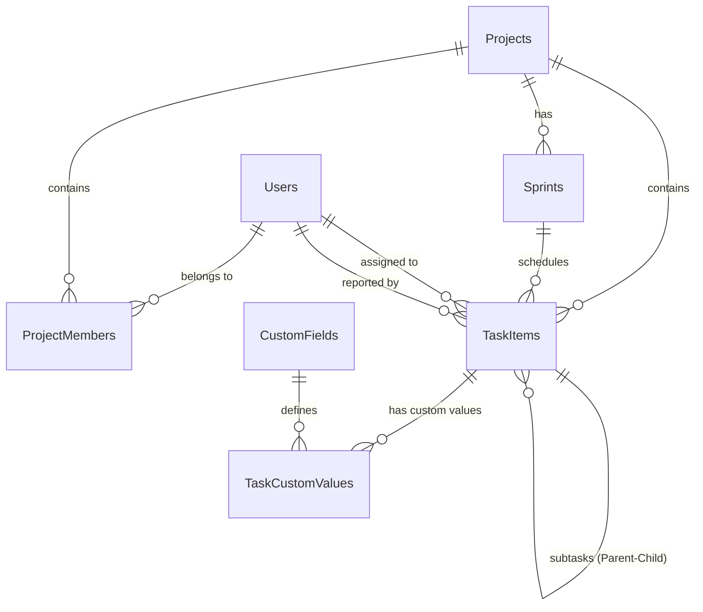

# TaskManager - Hệ thống Quản lý Công việc Mô hình Agile/Scrum

Hệ thống **TaskManager** là một ứng dụng quản lý công việc và dự án phần mềm theo mô hình Agile/Scrum. Dự án được phát triển theo kiến trúc Client-Server, sử dụng **ASP.NET Core Web API** cho Backend và **Angular** cho Frontend, với cơ sở dữ liệu **Microsoft SQL Server**.

---

## 📌 Kiến trúc Tổng quan (System Architecture)

Hệ thống tuân thủ kiến trúc chia lớp (layered client-server architecture):



*   **Frontend (Client)**: Ứng dụng Single Page Application (SPA) xây dựng trên Angular 18+, quản lý giao diện tương tác, biểu đồ dashboard, bảng danh sách công việc, và các drawer thao tác chi tiết.
*   **Backend (Server)**: ASP.NET Core Web API đóng vai trò xử lý nghiệp vụ, xác thực JWT, phân quyền truy cập dự án và xuất báo cáo tiến độ.
*   **Database (Storage)**: SQL Server quản lý dữ liệu thực thể thông qua Entity Framework Core (Code First).

---

## 📁 Cấu trúc Thư mục (Directory Structure)

Dự án được chia làm hai thư mục chính tương ứng với hai phần của hệ thống:

```
TaskManager/
├── TaskManager.Api/            # ASP.NET Core Web API (Backend)
│   ├── Controllers/            # Điều hướng request (Auth, Tasks, Projects, Reports)
│   ├── Data/                   # Ngữ cảnh cơ sở dữ liệu (AppDbContext.cs)
│   ├── Migrations/             # Lịch sử EF Core Migrations
│   ├── Models/                 # Thực thể (Entities) và DTOs (TaskItem, Project, Sprint,...)
│   ├── Properties/             # Cấu hình môi trường chạy (launchSettings.json)
│   ├── Services/               # Lớp xử lý logic nghiệp vụ (ProjectService, TaskPermissionService)
│   ├── Program.cs              # Điểm khởi chạy & Đăng ký dịch vụ (DI, Middleware, CORS, JWT)
│   └── appsettings.json        # Cấu hình Database Connection & JWT Settings
│
├── angular-task/               # Angular Single Page App (Frontend)
│   ├── src/
│   │   ├── app/
│   │   │   ├── components/     # Các Component UI (Dashboard, Table, Task Drawer, Assignee Selector)
│   │   │   ├── services/       # Lớp tương tác API (Auth, Project, Task Service)
│   │   │   ├── models/         # Định nghĩa các TypeScript Interface
│   │   │   └── app.ts          # Root component
│   │   └── main.ts             # Điểm khởi chạy của Angular
│   ├── angular.json            # Cấu hình Workspace của Angular
│   └── package.json            # Quản lý thư viện phụ thuộc phía Frontend
└── README.md                   # Tài liệu kiến trúc dự án (File này)
```

---

## 🗄️ Thiết kế Cơ sở Dữ liệu (Database Schema)

Cơ sở dữ liệu được thiết kế tập trung xung quanh thực thể công việc (`TaskItem`) và quản lý dự án Agile. Dưới đây là mối quan hệ giữa các bảng:



### Chi tiết các thực thể chính:

1.  **`ApplicationUser` (Bảng `Users`)**: 
    *   Lưu trữ thông tin tài khoản người dùng, bao gồm `Username`, `Email`, `PasswordHash` và `Role`.
2.  **`Project` (Bảng `Projects`)**:
    *   Đại diện cho một dự án trong hệ thống. Mỗi dự án có `Name` và `Code` (Ví dụ: `PROJ`).
3.  **`ProjectMember` (Bảng `ProjectMembers`)**:
    *   Bảng trung gian thiết lập quan hệ Many-to-Many giữa `Users` và `Projects`, xác định vai trò của thành viên trong dự án (ví dụ: `Admin`, `Member`).
4.  **`Sprint` (Bảng `Sprints`)**:
    *   Các phân đoạn công việc (Sprint) thuộc một dự án, quản lý bằng `Name`, `StartDate`, `EndDate` để phục vụ vẽ biểu đồ tiến độ.
5.  **`TaskItem` (Bảng `TaskItems`)**:
    *   Thực thể trung tâm, lưu trữ thông tin công việc:
        *   Trạng thái: `Todo`, `InProgress`, `InReview`, `Done`.
        *   Loại công việc: `Epic`, `Story`, `Task`, `Bug`.
        *   Độ ưu tiên: `Low`, `Medium`, `High`, `Critical`.
        *   Hỗ trợ quan hệ đệ quy **Cha - Con** (`ParentTaskId` - `SubTasks`) giúp phân nhỏ công việc.
6.  **`CustomField` & `TaskCustomValue` (Thiết kế EAV)**:
    *   Cho phép người dùng tự định nghĩa thêm các trường động cho công việc mà không làm thay đổi cấu trúc bảng vật lý. Hỗ trợ các kiểu dữ liệu: `Text`, `Number`, `Date`, `Boolean`.

---

## ⚡ Các Pattern & Công nghệ nổi bật

*   **Entity-Attribute-Value (EAV) Pattern**: Giúp thiết lập tính năng **Custom Fields** cho các nhiệm vụ một cách linh hoạt.
*   **JWT Bearer Authentication**: Bảo mật các endpoint API, phân quyền chi tiết dựa trên vai trò của người dùng trong hệ thống và trong từng dự án cụ thể (`ITaskPermissionService`).
*   **Scrum Dashboard & Burndown Charts**: API phân tích dữ liệu hiệu suất của Sprint (`ReportsController`) để vẽ biểu đồ tiến độ hoàn thành công việc theo thời gian.
*   **Recursive Relations**: Cho phép ánh xạ cấu trúc Agile phân cấp từ `Epic -> Story -> Task -> Subtask` ngay trên bảng `TaskItems`.

---

## 🚀 Hướng dẫn Cài đặt & Chạy ứng dụng

### Yêu cầu hệ thống:
*   [.NET SDK 8.0+](https://dotnet.microsoft.com/download)
*   [Node.js 18+](https://nodejs.org/)
*   [SQL Server / SQL Express](https://www.microsoft.com/en-us/sql-server/sql-server-downloads)

### 1. Khởi chạy Backend (API)
1.  Đảm bảo SQL Server đang hoạt động và cấu hình connection string chính xác tại [appsettings.json](file:///d:/TaskManager/TaskManager.Api/appsettings.json).
2.  Mở terminal tại thư mục `TaskManager.Api` và chạy các lệnh:
    ```bash
    dotnet restore
    dotnet ef database update   # Áp dụng các bảng vào Database
    dotnet run                  # Chạy API tại port http://localhost:5122
    ```

### 2. Khởi chạy Frontend (Angular)
1.  Mở terminal tại thư mục `angular-task`.
2.  Cài đặt các gói thư viện:
    ```bash
    npm install
    ```
3.  Chạy ứng dụng khách:
    ```bash
    npm run start               # Chạy tại địa chỉ http://localhost:4200
    ```
