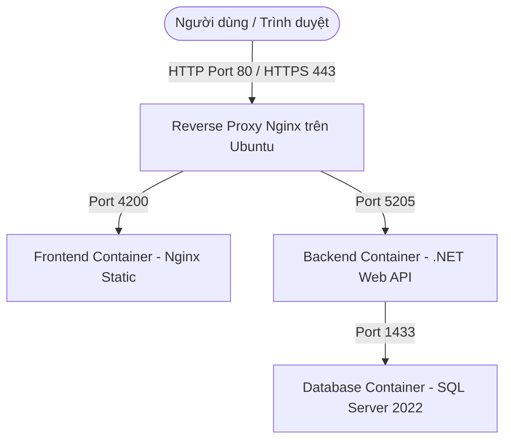

# 🐳 HƯỚNG DẪN TRIỂN KHAI TASKMANAGER BẰNG DOCKER LÊN UBUNTU

Tài liệu này hướng dẫn bạn cách đóng gói toàn bộ hệ thống **TaskManager** (bao gồm Backend .NET 10, Frontend Angular 18+ và Database SQL Server 2022) bằng **Docker** và **Docker Compose**, sau đó triển khai lên máy chủ **Ubuntu Server**.

---

## 🏗️ Kiến trúc Triển khai (Deployment Architecture)



---

## 📋 1. Chuẩn bị Môi trường trên Ubuntu

Trước hết, bạn cần cài đặt Docker Engine và Docker Compose trên máy chủ Ubuntu. Chạy các lệnh sau:

### Bước 1: Cập nhật hệ thống và cài đặt các thư viện cần thiết
```bash
sudo apt update && sudo apt upgrade -y
sudo apt install -y curl apt-transport-https ca-certificates gnupg lsb-release
```

### Bước 2: Thêm khóa GPG và kho lưu trữ của Docker
```bash
sudo mkdir -p /etc/apt/keyrings
curl -fsSL https://download.docker.com/linux/ubuntu/gpg | sudo gpg --dearmor -o /etc/apt/keyrings/docker.gpg

echo \
  "deb [arch=$(dpkg --print-architecture) signed-by=/etc/apt/keyrings/docker.gpg] https://download.docker.com/linux/ubuntu \
  $(lsb_release -cs) stable" | sudo tee /etc/apt/sources.list.d/docker.list > /dev/null
```

### Bước 3: Cài đặt Docker
```bash
sudo apt update
sudo apt install -y docker-ce docker-ce-cli containerd.io docker-compose-plugin
```

### Bước 4: Cấp quyền chạy Docker không cần sudo (Tùy chọn nhưng khuyến nghị)
Thay thế `your-user` bằng tên người dùng Ubuntu hiện tại của bạn:
```bash
sudo usermod -aG docker $USER
newgrp docker
```
*Để kiểm tra xem Docker đã hoạt động chưa, chạy lệnh:* `docker --version` hoặc `docker compose version`.

---

## 📂 2. Cấu trúc các file Docker trong dự án

Dự án hiện đã được cấu hình đầy đủ các file Docker để bạn chỉ việc chạy lệnh. Dưới đây là thông tin chi tiết:

### A. Dockerfile cho Backend ([TaskManager.Api/Dockerfile](file:///d:/TaskManager/TaskManager.Api/Dockerfile))
Dockerfile đa giai đoạn giúp giảm thiểu kích thước ảnh (image) chạy cuối cùng:
* Sử dụng `.NET SDK 10.0` để build và publish ứng dụng ở chế độ Release.
* Sử dụng `.NET ASP.NET 10.0` runtime nhỏ gọn để chạy ứng dụng.
* Tự động tạo thư mục `wwwroot` để chứa các file tải lên.

### B. Dockerfile cho Frontend ([angular-task/Dockerfile](file:///d:/TaskManager/angular-task/Dockerfile))
* **Giai đoạn 1**: Sử dụng `node:20-alpine` để cài đặt dependencies (`npm ci`) và build ứng dụng Angular ở chế độ production (`npm run build`).
* **Giai đoạn 2**: Sử dụng web server `nginx:alpine` siêu nhẹ để phục vụ các file tĩnh được build từ Angular. 
* Sử dụng file cấu hình [angular-task/nginx.conf](file:///d:/TaskManager/angular-task/nginx.conf) để cấu hình định tuyến cho Single Page Application (tránh lỗi 404 khi người dùng tải lại trang web).

### C. File Orchestration ([docker-compose.yml](file:///d:/TaskManager/docker-compose.yml))
Định nghĩa cụm 3 container chính:
* **`db`** (SQL Server 2022): Lưu trữ dữ liệu thực tế tại Docker volume `mssql_data` để không bị mất khi container khởi động lại.
* **`backend`**: Chạy Web API trên port `8080` bên trong container và map ra ngoài qua port `5205`. Tự động nhận biến cấu hình Database ConnectionString hướng tới container `db`.
* **`frontend`**: Chạy web server Nginx phục vụ client trên port `80` bên trong container và map ra ngoài qua port `4200` (trùng khớp với cài đặt CORS mặc định của backend giúp chạy thử nghiệm nhanh trên localhost không bị lỗi).

---

## 🚀 3. Triển khai nhanh trên Localhost hoặc Server thử nghiệm

Nếu bạn chạy Docker trực tiếp trên máy cá nhân hoặc server test và truy cập qua địa chỉ `http://localhost:4200`:

### Bước 1: Sao chép dự án lên server
Sử dụng Git hoặc FTP để đẩy toàn bộ thư mục dự án lên Ubuntu Server.

### Bước 2: Chạy Docker Compose
Mở terminal tại thư mục gốc của dự án (nơi có file `docker-compose.yml`) và chạy:
```bash
docker compose up --build -d
```
Lệnh này sẽ:
1. Tải các base image từ Docker Hub (SQL Server, .NET, Node.js, Nginx).
2. Biên dịch source code của Backend API và Frontend Angular.
3. Khởi chạy 3 container ở chế độ chạy ngầm (`-d`).
4. Backend API khi khởi chạy sẽ **tự động chạy các bản cập nhật database (EF Migrations) và Seeder dữ liệu** (tạo tài khoản `admin` / `admin123`, `developer1` / `dev123`...) kết nối vào cơ sở dữ liệu SQL Server.

### Bước 3: Kiểm tra trạng thái
```bash
docker compose ps
```
Nếu cả 3 container ở trạng thái `running` (hoặc `Up`), bạn có thể truy cập hệ thống tại địa chỉ:
* **Frontend**: [http://localhost:4200](http://localhost:4200)
* **Backend Swagger API**: [http://localhost:5205/openapi/v1.json](http://localhost:5205/openapi/v1.json) hoặc test endpoint [http://localhost:5205/api/tasks](http://localhost:5205/api/tasks)

---

## 🌐 4. Triển khai Môi trường Production (Tên miền và SSL)

Khi triển khai lên production thực tế trên Ubuntu (truy cập qua tên miền như `https://task.example.com` và `https://api-task.example.com`), bạn cần thực hiện các cấu hình sau:

### Bước 1: Cập nhật Cấu hình CORS ở Backend
Mở file [TaskManager.Api/Program.cs](file:///d:/TaskManager/TaskManager.Api/Program.cs) và bổ sung tên miền production của bạn vào chính sách CORS:
```csharp
policy.WithOrigins("http://localhost:4200", "https://task.example.com") // Thêm tên miền của bạn
```
*Sau đó build lại container backend để áp dụng thay đổi.*

### Bước 2: Cập nhật URL Gọi API của Frontend
Mở file [angular-task/src/app/services/task.service.ts](file:///d:/TaskManager/angular-task/src/app/services/task.service.ts) để điều chỉnh URL gọi API. Hàm `getApiBaseUrl()` mặc định đã được thiết lập:
* Nếu người dùng truy cập từ `localhost` thì trỏ về `http://localhost:5205/api`.
* Nếu truy cập từ bên ngoài thì trỏ về `https://api-task.anhnguyen.click/api` (hoặc địa chỉ IP/domain production khác).
Bạn hãy sửa dòng này:
```typescript
return 'https://api-task.example.com/api'; // Thay bằng domain API của bạn
```
*Sau đó build lại container frontend để áp dụng cấu hình.*

### Bước 3: Cấu hình Reverse Proxy Nginx trên Hệ điều hành Ubuntu (Host)
Thông thường trên production, chúng ta không mở trực tiếp port `5205` và `4200` ra internet mà sử dụng Nginx cài trực tiếp trên máy chủ Ubuntu để làm cổng trung chuyển (Reverse Proxy) và cài đặt chứng chỉ SSL tự động (Let's Encrypt).

1. Cài đặt Nginx trên Ubuntu:
   ```bash
   sudo apt install -y nginx
   ```
2. Tạo file cấu hình site cho TaskManager:
   ```bash
   sudo nano /etc/nginx/sites-available/taskmanager
   ```
3. Nhập cấu hình reverse proxy sau (chỉ cấu hình cổng HTTP 80 trước, SSL sẽ tự động cấu hình sau):
   ```nginx
   # Cấu hình cho Frontend Angular
   server {
       listen 80;
       server_name task.example.com;

       location / {
           proxy_pass http://localhost:4200;
           proxy_http_version 1.1;
           proxy_set_header Upgrade $http_upgrade;
           proxy_set_header Connection 'upgrade';
           proxy_set_header Host $host;
           proxy_cache_bypass $http_upgrade;
       }
   }

   # Cấu hình cho Backend .NET Web API
   server {
       listen 80;
       server_name api-task.example.com;

       # Tăng kích thước tối đa cho file upload (ví dụ: 50MB)
       client_max_body_size 50M;

       location / {
           proxy_pass http://localhost:5205;
           proxy_http_version 1.1;
           proxy_set_header Upgrade $http_upgrade;
           proxy_set_header Connection 'upgrade';
           proxy_set_header Host $host;
           proxy_cache_bypass $http_upgrade;
           proxy_set_header X-Real-IP $remote_addr;
           proxy_set_header X-Forwarded-For $proxy_add_x_forwarded_for;
           proxy_set_header X-Forwarded-Proto $scheme;
       }
   }
   ```
4. Kích hoạt cấu hình và restart Nginx:
   ```bash
   sudo ln -s /etc/nginx/sites-available/taskmanager /etc/nginx/sites-enabled/
   sudo nginx -t
   sudo systemctl restart nginx
   ```

### Bước 4: Cài đặt SSL Let's Encrypt miễn phí với Certbot
1. Cài đặt Certbot:
   ```bash
   sudo apt install -y certbot python3-certbot-nginx
   ```
2. Chạy certbot tự động quét cấu hình Nginx và cài SSL:
   ```bash
   sudo certbot --nginx -d task.example.com -d api-task.example.com
   ```
   *Certbot sẽ tự động đăng ký SSL, cài đặt vào Nginx và cấu hình tự động chuyển hướng từ HTTP sang HTTPS.*

---

## 🛠️ 5. Các lệnh Quản trị Docker Hữu ích

Khi hệ thống đã chạy bằng Docker Compose, bạn có thể quản trị bằng các lệnh sau:

* **Xem log thời gian thực của toàn bộ hệ thống**:
  ```bash
  docker compose logs -f
  ```
* **Xem log của riêng backend hoặc frontend**:
  ```bash
  docker compose logs -f backend
  docker compose logs -f frontend
  ```
* **Dừng toàn bộ hệ thống (dữ liệu vẫn được giữ ở volume)**:
  ```bash
  docker compose down
  ```
* **Khởi động lại các container**:
  ```bash
  docker compose restart
  ```
* **Xem dung lượng ổ đĩa của các container và volume**:
  ```bash
  docker system df
  ```
* **Xóa bỏ các ảnh Docker thừa để giải phóng dung lượng**:
  ```bash
  docker system prune -a --volumes -y
  ```
