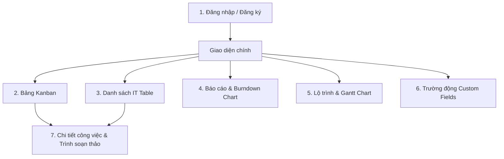

# 📖 HƯỚNG DẪN SỬ DỤNG HỆ THỐNG TASKMANAGER

Chào mừng bạn đến với hướng dẫn sử dụng hệ thống **TaskManager** - Ứng dụng quản lý công việc và dự án phần mềm theo mô hình Agile/Scrum. 

Tài liệu này sẽ hướng dẫn bạn chi tiết từ cách đăng nhập, quản lý dự án, thao tác với bảng Kanban, quản lý các trường tùy chỉnh (Custom Fields) theo mô hình EAV, lọc nâng cao, theo dõi biểu đồ tiến độ (Burndown Chart) và xem lịch trình Gantt Chart.

---

## 🗺️ Bản đồ Tính năng (Site Map & Features)

---

## 🔑 1. Đăng nhập & Đăng ký Tài khoản (Authentication)

Hệ thống hỗ trợ cơ chế xác thực thông qua JWT Bearer. Khi bạn mở ứng dụng, giao diện Đăng nhập sẽ hiển thị đầu tiên.

### 👤 Tài khoản thử nghiệm mặc định (Seeded Accounts)
Hệ thống đã được cài đặt sẵn một số tài khoản thử nghiệm với dữ liệu mẫu như sau:

| Tên đăng nhập (Username) | Mật khẩu (Password) | Vai trò hệ thống (Role) | Vai trò trong dự án |
| :--- | :--- | :--- | :--- |
| **`admin`** | `admin123` | Hệ thống Admin | Quản trị dự án (Admin) |
| **`developer1`** | `dev123` | Người dùng (User) | Thành viên dự án (Member) |
| **`developer2`** | `dev223` | Người dùng (User) | Thành viên dự án (Member) |
| **`qa_tester`** | `qa123` | Người dùng (User) | Thành viên dự án (Member) |

### 📝 Đăng ký tài khoản mới
1. Nhấp vào nút **Sign up** dưới cùng của form đăng nhập.
2. Nhập thông tin: **Username**, **Email Address** và **Password**.
3. Nhấp **Create Account** để đăng ký. Hệ thống sẽ thông báo đăng ký thành công và tự động chuyển về chế mục đăng nhập để bạn truy cập.

---

## 👥 2. Quản lý Thành viên Dự án (Project Members)

Trong giao diện chính, góc phải thanh lọc (Filter Bar) hiển thị danh sách các thành viên tham gia dự án dưới dạng vòng tròn chữ cái (Avatar).

### ➕ Mời thành viên mới vào dự án
1. Nhấp vào nút có biểu tượng **`person_add`** (Mời thành viên) tại thanh lọc.
2. Một hộp thoại popup sẽ xuất hiện yêu cầu nhập email của thành viên bạn muốn thêm.
3. Nhập email của họ (ví dụ: `newdev@taskmanager.com`) và nhấn **Thêm**. 
4. Hệ thống sẽ kết nối API mời thành viên đó vào dự án và cập nhật danh sách Avatar hiển thị ngay lập tức.

### 🔍 Lọc công việc theo thành viên (Assignees)
* **Lọc đa tuyển chọn**: Nhấp chọn trực tiếp vào avatar của một hoặc nhiều thành viên trên thanh lọc. Các công việc tương ứng với các thành viên đó sẽ được lọc và hiển thị. Thành viên được chọn sẽ có viền xanh xung quanh.
* **Bỏ lọc**: Nhấp vào nút **Bỏ lọc** (nút X nhỏ bên cạnh danh sách avatar) để quay lại hiển thị toàn bộ công việc.

---

## 📋 3. Bảng công việc Kanban (Kanban Board)

Bảng Kanban là nơi làm việc chủ đạo theo mô hình Scrum. Công việc được chia thành 4 cột trạng thái chuẩn:
* **TO DO**: Công việc mới, đang chờ thực hiện.
* **IN PROGRESS**: Công việc đang được triển khai.
* **IN REVIEW**: Công việc đã hoàn thành và đang được xem xét/kiểm thử.
* **DONE**: Công việc đã hoàn tất và đóng lại.

### 🖱️ Kéo thả để cập nhật trạng thái (Drag & Drop)
* Bạn có thể nhấp giữ chuột vào một thẻ công việc và kéo sang cột trạng thái khác. 
* Khi kéo vào cột, nền của cột đó sẽ đổi màu và hiện khung nét đứt để chỉ định vị trí thả.
* Khi thả ra, hệ thống sẽ thực hiện cập nhật trạng thái công việc về backend API theo thời gian thực.

### ⚡ Tạo nhanh công việc trực tiếp trên cột (Quick Creation)
Ở cuối mỗi cột Kanban có một ô nhập liệu nhanh. 
* Nhập tiêu đề công việc vào ô đó và nhấn **Enter**.
* Công việc mới sẽ lập tức được khởi tạo ở backend và xuất hiện trên cột tương ứng.

### 🔍 Tìm kiếm công việc trên bảng
Sử dụng ô tìm kiếm **"Search board"** ở thanh lọc để tìm kiếm công việc. Hệ thống hỗ trợ lọc ngay lập tức theo tiêu đề công việc, mô tả chi tiết hoặc mã số công việc (ví dụ: `proj-1`).

---

## 📑 4. Giao diện Danh sách Công việc (List View)

Bên cạnh bảng Kanban, bạn có thể chuyển đổi sang chế độ xem **Danh sách** (List) từ Sidebar phía bên trái.

* Chế độ này hiển thị tất cả công việc dưới dạng bảng biểu chi tiết (IT Table), cho thấy mã công việc, tiêu đề, loại công việc, độ ưu tiên, người thực hiện, hạn chót và điểm Story Points.
* **Mô hình Cha - Con (Parent-Child Hierarchy)**: Nếu một công việc có các công việc con (Subtasks), bên cạnh mã công việc sẽ có biểu tượng mũi tên. Bạn nhấp vào biểu tượng này để mở rộng hoặc thu gọn danh sách công việc con ngay trong bảng.

---

## ✏️ 5. Chi tiết và Chỉnh sửa Công việc (Task Drawer & WYSIWYG Editor)

Để mở giao diện chi tiết hoặc chỉnh sửa công việc, bạn có thể click trực tiếp vào thẻ công việc trên bảng Kanban hoặc bấm nút chỉnh sửa (biểu tượng chiếc bút) ở danh sách. Một Drawer/Modal chi tiết sẽ trượt ra.

### 📝 Trình soạn thảo Mô tả WYSIWYG Rich Text
Phần **Description** của công việc hỗ trợ soạn thảo văn bản đa định dạng chuyên nghiệp. Bạn có thể sử dụng thanh công cụ soạn thảo để:
* Định dạng chữ: **Bold** (In đậm), *Italic* (In nghiêng), Underline (Gạch chân), Strikethrough (Gạch ngang).
* Căn lề văn bản, tăng/giảm thụt lề dòng.
* Tạo danh sách: Danh sách không thứ tự (Unordered List) và danh sách có thứ tự (Ordered List).
* Chèn liên kết (Link URL).
* Viết code mẫu (Code block), căn chỉnh màu sắc và xóa định dạng nhanh.

### ⚙️ Thiết lập Thuộc tính Agile
* **Sprint / Project**: Chọn Sprint mà công việc thuộc về (ví dụ: `Sprint 2`, `Sprint 3`).
* **Story Points**: Điền số điểm Story Points để ước lượng khối lượng công việc phục vụ vẽ biểu đồ Burndown Chart.
* **Priority (Độ ưu tiên)**: Chọn giữa *Low*, *Medium*, *High*, *Critical*.
* **Task Type (Loại công việc)**: Chọn *Epic*, *Story*, *Task*, hoặc *Bug*.
* **Due Date (Hạn chót)**: Thiết lập ngày giờ hoàn thành dự kiến.

### 📌 Quản lý các công việc con (Subtasks)
Trong Drawer chi tiết:
1. Nhập tiêu đề công việc con vào ô nhập liệu dưới phần Subtasks.
2. Nhấn **Thêm** để lưu nhanh công việc con này vào danh sách.
3. Bạn có thể nhấp vào biểu tượng thùng rác để xóa nhanh công việc con nếu không cần thiết.

---

## 🔍 6. Lọc nâng cao theo Trường động (Advanced EAV Filtering)

Hệ thống hỗ trợ tính năng lọc cực kỳ mạnh mẽ đối với các trường dữ liệu động (Custom Fields) nhờ thiết kế Entity-Attribute-Value (EAV).

### ⚙️ Cách cấu hình bộ lọc nâng cao
1. Nhấp vào nút **Lọc nâng cao (EAV)** trên thanh lọc của bảng Kanban. Khung cấu hình bộ lọc sẽ trượt xuống.
2. Chọn toán tử logic liên kết giữa các điều kiện: **Tất cả (AND)** hoặc **Ít nhất một (OR)**.
3. Bấm **Thêm điều kiện**.
4. Với mỗi dòng điều kiện mới:
   * **Chọn trường động** cần lọc trong danh sách (hệ thống tự lấy danh sách trường động hiện có).
   * **Chọn toán tử so sánh**: 
     * `Equals` (Bằng): Giá trị bằng chính xác.
     * `Contains` (Chứa): Giá trị chứa chuỗi ký tự nhập vào.
     * `GreaterThan` (Lớn hơn): Dành cho số hoặc ngày tháng.
     * `LessThan` (Nhỏ hơn): Dành cho số hoặc ngày tháng.
     * `IsTrue` (Là Đúng): Dành cho trường Boolean (checkbox).
     * `IsFalse` (Là Sai): Dành cho trường Boolean (checkbox).
   * **Nhập giá trị lọc** vào ô văn bản tương ứng (nếu toán tử yêu cầu).
5. Sau khi thiết lập xong các điều kiện, nhấn **Áp dụng bộ lọc** để lọc dữ liệu. Nhấn **Xóa bộ lọc** để quay lại hiển thị ban đầu.

---

## 🛠️ 7. Quản lý Trường động (Custom Fields Management)

Khi cần mở rộng thông tin cho công việc mà không muốn can thiệp vào cơ sở dữ liệu hệ thống, bạn có thể tạo thêm các Custom Fields.

1. Truy cập **Custom Fields** từ Sidebar.
2. Bấm nút **Thêm trường mới**.
3. Điền các thông tin:
   * **Tên trường (Name)**: Tên hiển thị (ví dụ: `Ước tính Chi phí`, `Ngày Test`).
   * **Kiểu dữ liệu (Data Type)**: Chọn 1 trong 4 kiểu: `Text`, `Number` (Số), `Date` (Ngày tháng), hoặc `Boolean` (True/False).
4. Nhấn **Lưu** để khởi tạo trường động. 
5. Sau khi tạo, trường động này sẽ tự động xuất hiện tại phần chỉnh sửa thông tin của mọi Task Drawer để bạn nhập dữ liệu cụ thể.

---

## 📊 8. Báo cáo Tiến độ Sprint & Biểu đồ Burndown (Reports)

Để theo dõi tiến độ của dự án, chuyển đến màn hình **Reports** ở Sidebar.

### 📉 Biểu đồ Burndown Chart
Biểu đồ Burndown Chart vẽ bằng đồ họa vector SVG động, giúp đội ngũ Agile theo dõi xem công việc có đang đi đúng kế hoạch hay không.
* **Đường Lý thuyết (Đường nét đứt màu xám - Ideal Path)**: Thể hiện tốc độ hoàn thành công việc lý tưởng theo thời gian, giảm đều từ tổng số điểm Story Points ban đầu về 0 ở ngày cuối Sprint.
* **Đường Thực tế (Đường nét liền màu xanh - Actual Path)**: Thể hiện lượng Story Points thực tế còn lại của Sprint tính tới cuối mỗi ngày làm việc.
  * Nếu đường thực tế nằm **dưới** đường lý thuyết: Đội ngũ đang hoàn thành công việc nhanh hơn dự kiến (tốt).
  * Nếu đường thực tế nằm **trên** đường lý thuyết: Dự án đang có nguy cơ bị trễ hạn so với kế hoạch Sprint.
* **Chọn Sprint**: Bạn có thể chọn các Sprint khác nhau từ menu xổ xuống để xem biểu đồ và thống kê chi tiết của từng Sprint.

---

## 📅 9. Biểu đồ Gantt Chart / Lộ trình (Roadmap)

Chọn tab **Gantt Chart** từ Sidebar để xem lộ trình công việc trực quan.

* Trục ngang hiển thị các mốc ngày trong khoảng thời gian hoạt động của Sprint hiện tại.
* Mỗi công việc được biểu diễn bằng một thanh ngang có chiều dài tương ứng với khoảng thời gian thực hiện (từ ngày bắt đầu đến ngày hạn chót).
* Chế độ xem này giúp quản lý dự án (Project Manager) dễ dàng nhận thấy sự chồng chéo, phụ thuộc thời gian giữa các đầu việc và điều chỉnh nguồn lực phù hợp.
